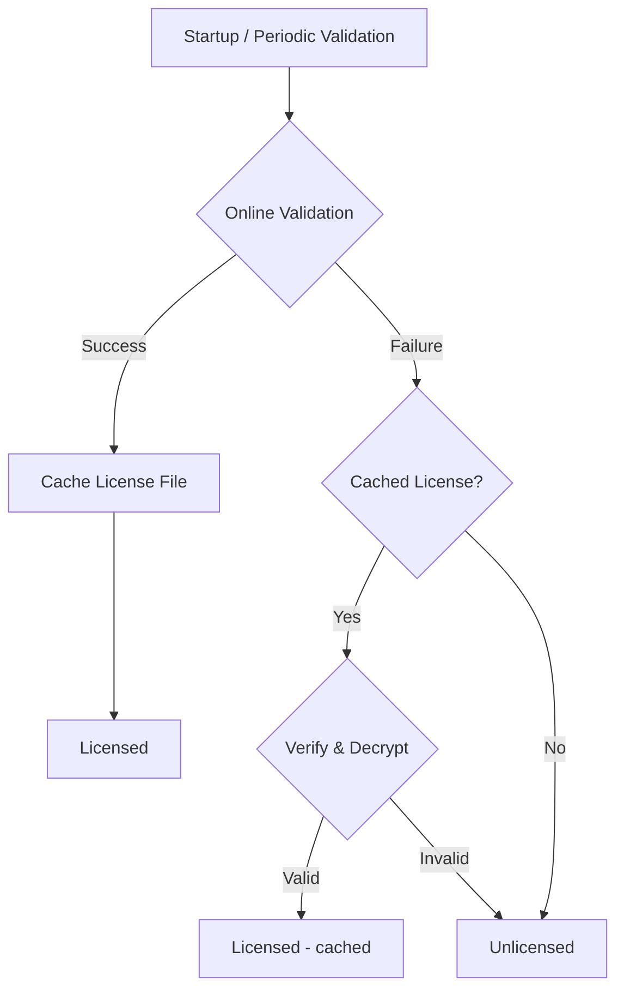

import { Aside } from "@astrojs/starlight/components";

ricochet uses [Keygen](https://keygen.sh) for license management with two tiers: **Homelab** and **Enterprise**.

## License Tiers

| Feature | Homelab | Enterprise |
|---------|------|----------|
| Deploy content | Yes | Yes |
| Public/internal visibility | Yes | Yes |
| Private content visibility | No | Yes |
| All premium features | No | Yes |

<Aside type="tip">
You can run ricochet indefinitely without a license for evaluation and non-commercial use.
</Aside>

## Obtaining a License

Licenses can be purchased through the self-service portal at [license.ricochet.rs](https://license.ricochet.rs).
Once you complete your purchase, you'll receive:

- **Account ID**: Your Keygen account identifier
- **Product ID**: The ricochet product identifier
- **License Key**: Your unique license key
- **Public Key** (optional): Used for cryptographic signature verification of license responses

<Aside type="caution">
ricochet requires network connectivity to `licensing.ricochet.rs` for license validation.
Ensure your firewall and network policies allow outbound HTTPS connections to this endpoint.
</Aside>

<Aside type="tip">
If the licensing server becomes temporarily unreachable after a successful validation, ricochet continues using the last known license status until the next successful validation.
</Aside>

## Offline Licensing

ricochet supports offline license verification using cryptographically signed license files.
This allows for seamless operation even if you can't reach the licensing server.

### How It Works

1. **Online validation succeeds**: When ricochet successfully validates your license online, it automatically downloads and caches a signed license file locally.

2. **Network becomes unavailable**: If a subsequent validation attempt fails due to network issues, ricochet falls back to verifying the cached license file.

3. **Cryptographic verification**: The cached license file contains:
    - An Ed25519 signature to verify authenticity
    - AES-256-GCM encrypted license data
    - Expiry information for the cached certificate

<Aside type="caution">
Offline verification requires the `public_key` configuration option.
Without it, ricochet cannot verify the signature of cached license files and will fall back to unlicensed mode when offline.
</Aside>

### Cache Location

The license file is cached at `$RICOCHET_HOME/.license.lic`.
This file is automatically managed by ricochet and refreshed on each successful online validation.

### Validation Flow



## Configuration

License configuration can be set via environment variables or in `ricochet.toml`.

### Environment Variables

```bash
RICOCHET_LICENSE__ACCOUNT_ID=your-account-id
RICOCHET_LICENSE__PRODUCT_ID=your-product-id
RICOCHET_LICENSE__LICENSE_KEY=your-license-key
RICOCHET_LICENSE__PUBLIC_KEY=optional-public-key
```

### TOML Configuration

Add the following to your `ricochet.toml`:

```toml
[license]
account_id = "your-account-id"
product_id = "your-product-id"
license_key = "your-license-key"
# Hex-encoded Ed25519 public key (64 characters) - required for offline licensing
public_key = "e8601e48b69383ba520245fd07971e983d06d22c4257cfd82304601479cee788"
```

| Field | Required | Description |
|-------|----------|-------------|
| `account_id` | Yes | Your Keygen account identifier |
| `product_id` | Yes | The ricochet product identifier |
| `license_key` | Yes | Your unique license key |
| `public_key` | No | Ed25519 public key (hex-encoded, 64 characters) for cryptographic verification. **Required for offline licensing** - without it, ricochet cannot verify cached license files during network outages. Also provides additional security for online validation by ensuring responses haven't been tampered with. Obtain this from your Keygen account settings under "Ed25519 Public Key". |

<Aside type="note">
Environment variables take precedence over TOML configuration values.
</Aside>

## License Validation

ricochet validates your license in two scenarios:

1. **At startup**: The license is validated when ricochet starts. If validation fails, ricochet continues in free tier mode with a warning logged.

2. **Periodically**: A background service validates the license every hour to ensure the license stays current.

### Recurring Validation Failures

If periodic validation fails (e.g., due to network issues), ricochet continues using the last successfully validated license status.
This ensures temporary network outages don't disrupt your service.

However, if the license was never successfully validated (e.g., startup validation failed and no cached state exists), ricochet remains in free tier mode until a successful validation occurs.

### Viewing License Status

Check the ricochet logs at startup for license status:

```
INFO Validating license with Keygen at licensing.ricochet.rs
INFO License validated successfully
```

Or in free tier mode:

```
WARN License validation failed at startup: ... Running in free tier mode.
```
